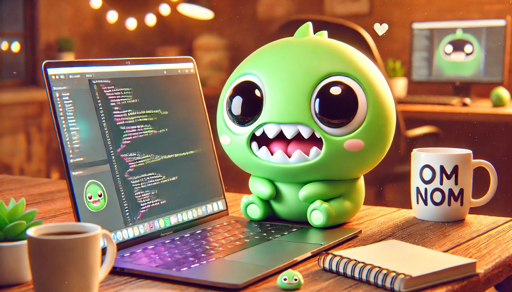

<h1 align="center">Hi there👋</h1>
<h3 align="center">I'm Maksym - a Junior Backend Developer from Ukraine</h3>

  

📫 How to reach me → solonitsyn.maksym@gmail.com
    
<h3 align="center">Technology Stack</h3>

 
             
            
             
            
            
             
            
            
            
            
            
            
            
            
            
            
            
            
            
            
            
            
            
            
            
            

<!---->

<!-- GRS (Light Mode) -->
<a href="https://github.com/qwerty541#gh-light-mode-only">
  <table cellspacing="0" cellpadding="0">
    <tr>
      <td style="border: 0;">
          
      </td>
      <td style="border: 0;">
          
      </td>
    </tr>
  </table>
</a>

<!-- GRS (Dark Mode) -->
<a href="https://github.com/qwerty541#gh-dark-mode-only">
  <table cellspacing="0" cellpadding="0">
    <tr>
      <td style="border: 0;">
        
      </td>
      <td style="border: 0;">
        
      </td>
    </tr>
  </table>
</a>

<!-- Streak stats (Light mode) -->

  

<!-- Streak stats (Dark mode) -->

  

<!-- WakaTime stats (Light mode) -->

  

